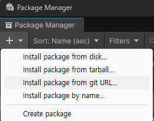

# 유니티 모듈형 행동 시스템
---

## 1. 소개

이 유니티 용 패키지는 모듈형 행동 시스템을 제공합니다. 이 시스템은 게임 오브젝트에 다양한 행동을 쉽게 추가하고 관리할 수 있도록 설계되었습니다. 각 행동은 독립적인 모듈로 구현되어 있어, 재사용성과 유지보수성이 뛰어납니다.

런타임에 불변 또는 준불변성을 가지는 Setting, 런타임에 현재 상태를 나타내는 Context, 그리고 행동의 실행을 담당하는 행동 단위 Processor으로 구성되어 있습니다.

## 2. 주요 기능

- **유니티 인스펙터 지원**

	유니티 인스펙터에서 Setting, Processor, Context를 쉽게 설정할 수 있습니다. 이를 통해 디자이너와 개발자가 협업하여 행동을 조정할 수 있습니다.

- **유연한 행동 구성**
	
	Processor의 구성을 다르게 하여, 다양한 행동을 만들 수 있습니다. 이를 통해서 확장성과 재사용성이 극대화됩니다.

- **런타임 GC 최소화**
	
	런타임에 GC를 거의 발생시키지 않습니다. 이는 게임의 성능을 향상시키고, 프레임 드랍을 방지하는 데 도움이 됩니다.

## 3. 사용 방법

1. 패키지 설치: 유니티 패키지 매니저를 통해 이 패키지를 프로젝트에 추가합니다.

	`https://github.com/Armangi1312/unity-am-modular-behavior-system.git`를 입력하여 패키지를 설치합니다.

2. 
